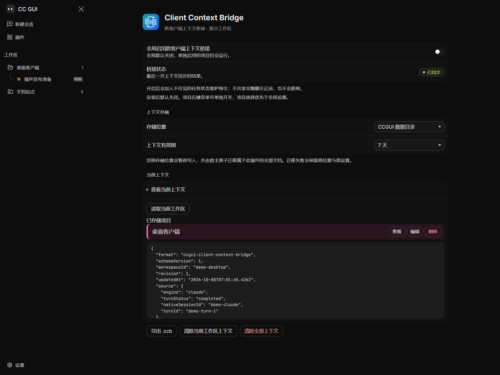
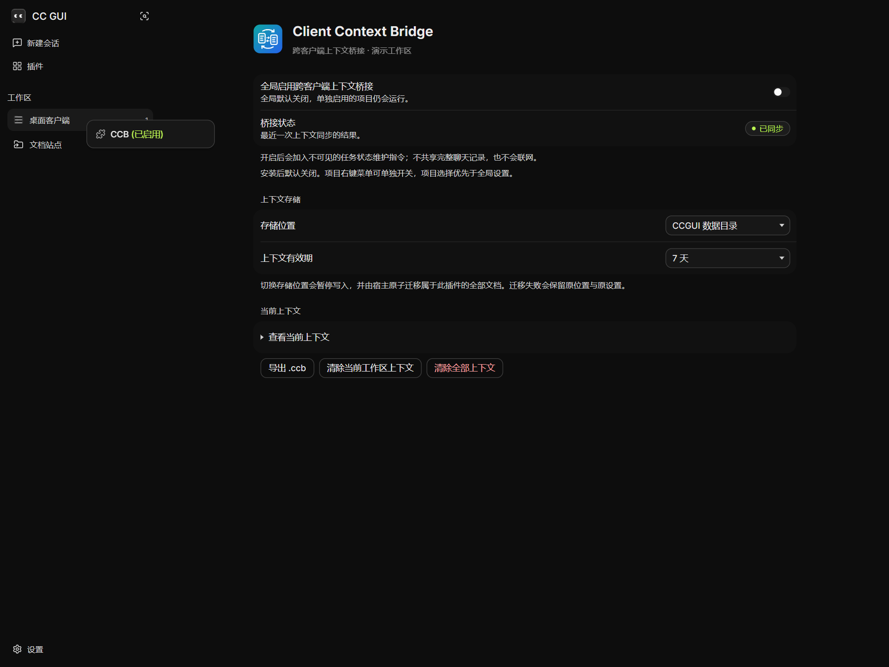

# 跨客户端上下文桥接（CCB）

**Client Context Bridge** 是 [CC GUI](https://github.com/zhukunpenglinyutong/desktop-cc-gui) 的社区插件：在 Claude Code、Codex CLI、Gemini CLI、OMP 等客户端之间切换时，自动维护当前任务的可执行上下文，并在目标客户端的新会话中接续，不必重新整理交接提示。

它传递的是任务状态，不是完整聊天记录。插件需要桌面宿主 **SDK ≥ 0.3.20**，安装后自动桥接默认关闭。

[下载最新版本](https://github.com/MurasameCyan/ccgui-plugin-client-context-bridge/releases/latest) · [反馈问题](https://github.com/MurasameCyan/ccgui-plugin-client-context-bridge/issues) · [MIT 许可证](LICENSE)

## 能做什么

- **维护任务上下文**：目标与验收条件、已完成与待完成事项、关键决策、风险、涉及文件和宿主观察到的执行结果。
- **跨客户端接续**：在同一工作区切换客户端后，把交接上下文注入目标新会话的首轮请求；只有宿主确认接纳后才记录消费。
- **按项目独立启停**：右键工作区即可开关 CCB；项目选择优先于全局默认，重载后仍保留。
- **管理本地 `.ccb`**：在设置页按项目查看、编辑、删除、导出上下文，设置有效期与存储位置。
- **保持工作区隔离**：回合始终归属其来源工作区；后台回合不会借用另一个项目的路径或 Git 元数据。无法读取活动工作区元数据时，仍保留任务更新与已接纳的交接记录。

## 安装

### 插件市场

首次上架须经[官方中央索引](https://github.com/zhukunpenglinyutong/ccgui-plugins)审核合并。条目上线后，在 CC GUI → **插件 → 市场** 搜索「跨客户端上下文桥接」或「CCB」并安装。

仓库公开或创建 Release 不会自动把插件加入市场；审核期间可用下面的手动安装方式。

### 从 Release 手动安装

1. 在 [Releases](https://github.com/MurasameCyan/ccgui-plugin-client-context-bridge/releases/latest) 下载 `ccgui-plugin-client-context-bridge-<版本>.zip`，**不要下载 GitHub 自动生成的 Source code 包**。
2. 解压后得到 `ccgui-plugin-client-context-bridge/`，目录内应有 `manifest.json`、`main.js`、`docs/` 等文件。
3. CC GUI → **插件 → 从本地目录安装** → 选择上述目录，不是 ZIP 文件。
4. 确认插件已启用，再按下一节为需要的工作区开启自动桥接。

升级时重新安装新版本的同 ID 目录即可更新代码和授权记录，宿主会热重载。仅点重载不会把下载的新包复制到安装目录。

## 使用

1. 右键左侧工作区文件夹，点击 **CCB（已禁用）**，该项目变为「已启用」。也可在设置中开启全局默认，让未单独设置的项目跟随。
2. 在该项目中正常对话。CCB 从下一轮请求开始提供维护协议，并在回合结算时保存上下文；仅点击开关不会立刻生成 `.ccb` 文件。
3. 打开 **设置 → Client Context Bridge → 查看当前上下文**，检查已存储的项目和内容。
4. 在同一工作区切换到另一个客户端并打开新会话。首轮请求会收到目标、进展、决策和下一步等交接信息。

已有会话也能中途启用：下一轮发送完整维护协议。插件不会回溯采集启用前的历史，也不替代各 CLI 自己的会话恢复功能。

### 配置

| 配置 | 默认 | 说明 |
|---|---|---|
| 全局启用跨客户端上下文桥接 | 关闭 | 仅决定没有项目级覆盖时的默认行为 |
| 工作区右键开关 | 跟随全局 | 单独启用或停用优先于全局设置 |
| 存储位置 | CCGUI 数据目录 | 可选择程序目录或经宿主授权的自定义目录 |
| 上下文有效期 | 7 天 | 可选择其他保留周期或永不过期 |

「桥接状态」显示已同步、等待同步、已降级、写入失败、已从其他客户端接续或已关闭。
模型没有返回有效语义 patch 时，插件仍可保存宿主事实并标记降级；这不等于拥有完整的任务摘要。

停用后不再追加自动维护提示或开始自动读写；手动查看、导出和清除仍可用。停用不会中断正在执行的 CLI 请求，也不会删除原生聊天历史。

## 界面

### 设置与上下文管理



### 工作区独立开关



截图由隔离预览加载真实插件组件生成，使用演示工作区和演示上下文，不包含个人会话数据。

## 数据与隐私

默认存储位置：

```text
<CCGUI 数据目录>/plugin-data/ccgui.client-context-bridge/<workspace-id>.ccb
```

`.ccb` 是 UTF-8 JSON，由插件通过宿主受控文档 API 读写，支持原子写、备份与版本冲突检查；模型不直接操作文件。
切换存储位置由宿主迁移文档，目录不可用时不会静默切到另一个位置。

- 不联网同步，不执行 shell，不修改项目源文件。
- 不保存模型思维过程、完整终端输出、文件正文或完整 Git diff。
- 不合并不同 CLI 的原生会话历史，不创建跨客户端共享会话。
- 启用后会向当前 CLI 请求加入内部维护提示和交接摘要，可能增加 token 用量；这些请求仍由你配置的 CLI／模型服务处理。
- `.ccb` 与当前工作区冲突时，以用户当前要求、工作区文件和实际命令结果为准。

## 宿主兼容与权限

需要提供 CCB 通用接口的 **桌面宿主 SDK ≥ 0.3.20**。原版 SDK 0.3.17–0.3.19 不含这批能力；只升级 AI CLI 无法补齐宿主接口。
当前 Web/LAN 插件桥不提供完整的 KV 写入、工作区元数据和文档存储命令，不能在浏览器客户端独立运行完整桥接流程。

| 权限 | 实际用途 |
|---|---|
| `storage` | 保存全局配置与项目级开关 |
| `plugin.storage` | 读写、导出前读取、清理与迁移 `.ccb` 文档 |
| `ui:settings-section` | 显示插件设置页 |
| `ui:workspace-menu` | 显示工作区右键开关 |
| `i18n` / `events` | 注册文案、广播桥接状态 |
| `session.lifecycle.read` | 观察会话新建、恢复与关闭 |
| `runtime.events.read` | 观察标准化运行时事实与回合结算 |
| `runtime.switch.observe` | 关联来源客户端与目标客户端的切换 |
| `prompt.contribute.internal` | 提供内部提示并接收经校验的语义 patch |
| `workspace.metadata.read` | 获取身份匹配的工作区与 Git 元数据 |
| `host:workspace` | 读取工作区列表，为已存储上下文显示项目名 |
| `network:none` | 声明插件不请求网络访问，不是网络授权 |

无需额外的 `assets:*`、`exec:*` 或 `host:workspace:remote` 权限。

## 开发与发布

主分支为 `main`，插件 ID 固定为 `ccgui.client-context-bridge`。

```bash
npm ci
npm run check:sdk
npm run check:release
npm test
npm run typecheck
```

构建和打包由 GitHub Actions 完成。`main` 推送或手动运行工作流会测试并生成 CI 安装包；正式发布时，推送与 `manifest.json` 的 `version` **完全一致、无 `v` 前缀**的 tag。
流水线在校验、测试和构建通过后发布 GitHub Release，附件包含：

- `main.js`、`manifest.json`：市场下载的独立插件文件。
- `checksums.txt`：上述独立文件的 SHA-256。
- 安装 ZIP 与 `SHA256SUMS`：用于手动安装和校验。

本插件没有独立的 `styles.css`，界面样式随 JS 组件提供。首次上架还需登记中央索引与文件 SHA-256，不能用 ZIP 校验值替代单文件校验值。

## 许可

[MIT](LICENSE) © MurasameCyan。
